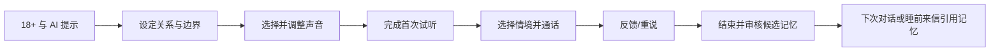

# Vowice PRD v0.1（待用户验证）

## 文档信息

| 项 | 内容 |
|---|---|
| 产品 | 声契 Vowice |
| 版本 | v0.1，需求假设版 |
| 日期 | 2026-06-18 |
| 负责人 | 产品经理：待填写；开发：待填写 |
| 状态 | Draft；完成首轮用户访谈后升级至 v0.5 |

## 1. 背景

通用 AI 产品已能提供角色设定、语音对话和文本记忆，但这些能力多作为聊天附加功能。Vowice 将声音本身作为角色身份，用用户可控的长期记忆和主动声音仪式建立关系连续性。

## 2. 产品目标

### 用户目标

- 创建一把符合自己想象且能长期保持一致的声音。
- 在想分享日常、放松或被陪伴时，快速进入一段声音交流。
- 知道哪些内容被记住，并能修改或删除。
- 在下一次互动中感受到过去的共同经历正在发生作用。

### 本周业务/作品集目标

- 验证“声音身份 + 用户确认记忆 + 主动仪式”是否比单纯语音聊天更有吸引力。
- 建立一个可被真实用户测试的端到端 MVP。
- 记录 PM 在用户证据、技术约束、体验和风险之间的决策过程。

## 3. 非目标

- 本版不代表可直接提交 App Store 的生产版本。
- 不建设 AI 朋友圈、群聊或多角色世界。
- 不允许复制任意真人、明星或逝者声音。
- 不提供心理治疗、医疗建议或未成年人虚拟伴侣服务。

## 4. 主要用户流

## 5. 功能需求

| ID | 需求 | 优先级 | 验收标准 |
|---|---|---|---|
| ONB-01 | 成年确认与 AI 身份提示 | P0 | 未确认 18+ 无法进入；用户能在创建前看到 AI 属性与麦克风用途 |
| REL-01 | 创建名字、称呼与关系阶段 | P0 | 设定被保存，并在对话中正确使用 |
| REL-02 | 设置沟通风格、主动频率与禁忌 | P0 | 修改后在下一轮生效；关闭主动联系后不再调度 |
| VOI-01 | 选择基础音色并试听 | P0 | 至少 3 把合法基础音色；试听失败可重试 |
| VOI-02 | 调整声音特质并保存配方 | P0 | 保存 `voice_id + recipe`；同一配方多次生成时身份稳定 |
| CAL-01 | 选择陪伴情境 | P0 | 至少 4 种情境；情境影响回复节奏和声场，不改变核心人设 |
| CAL-02 | 录音、识别、生成并播放回复 | P0 | 可连续 3 轮；后一轮能使用当前上下文；有倾听/理解/说话状态 |
| CAL-03 | 一键反馈并重说 | P0 | 支持说教、OOC、越界、重复；重说不改变已确认事实 |
| MEM-01 | 生成候选记忆 | P0 | 通话结束生成 0–3 条；未经用户确认不进入长期 Prompt |
| MEM-02 | 确认、修改、忽略和删除记忆 | P0 | 四种操作可完成；删除记忆不再被召回 |
| MEM-03 | 在后续互动中召回记忆 | P0 | 至少 1 条相关已确认记忆在下一 Session 中被自然使用 |
| LET-01 | 生成睡前声音来信 | P0 | 只在用户开启时生成；可引用当日已确认细节；可关闭 |
| MOM-01 | 回声日记/关系时刻 | P1 | 用户可回听至少一个保存时刻 |
| VOI-03 | A/B 式声音收敛 | P1 | 用户可在两个试听中选择更接近者并更新配方 |

## 6. 数据与埋点

| 事件 | 用途 |
|---|---|
| `onboarding_completed` | 测量初始流程完成率 |
| `voice_previewed` / `voice_saved` | 测量试听次数、创建耗时和放弃点 |
| `call_started` / `turn_completed` / `call_ended` | 测量通话完成率和延迟 |
| `reply_feedback_submitted` | 统计 OOC、越界、说教和重复问题 |
| `memory_proposed` / `memory_confirmed` / `memory_deleted` | 验证记忆价值与用户控制需求 |
| `letter_played` / `letter_completed` | 验证主动仪式的收听价值 |

## 7. 本周验证指标

- 5 名测试用户中至少 4 名可独立完成声音创建。
- 5 名中至少 4 名可完成 3 轮通话并找到结束入口。
- 5 名中至少 4 名理解记忆需要自己确认，并能删除。
- 至少 3 名能在无主持人提示时说出 Vowice 与普通 AI 语音聊天的一个差别。
- 严重越界、误记或无法删除数据均为 P0，不用平均满意度掩盖。

## 8. 待用户研究更新

- 最优先的使用场景和时段。
- 声音控件的数量、用词和试听方式。
- 主动联系的可接受频率。
- 用户希望自动忘记的内容类型。
- 睡前来信和情境声场是否应保持 P0。

