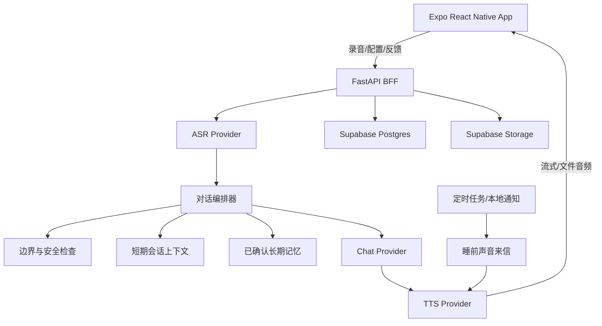

# Vowice 技术选型与架构建议

## 1. 结论

### 本周推荐栈

| 层 | 推荐 | 理由 |
|---|---|---|
| 移动客户端 | Expo + React Native + TypeScript + Expo Router | 一套代码快速真机调试，`expo-audio` 可完成录音与播放，适合 Agent 协作 |
| 状态管理 | Zustand + TanStack Query | 分离本地 UI 状态与服务器数据，心智负担较小 |
| 后端 | FastAPI + Pydantic | Python 语音生态成熟，方便封装不同模型 Provider |
| 数据库/文件 | Supabase Postgres + Storage | 快速获得托管数据库、存储和未来认证能力；可选 pgvector |
| 语音识别 | MVP 首选百炼 `qwen3-asr-flash`；开源备选 `faster-whisper` | 托管方案减少 GPU 和部署时间；开源备选为 MIT 许可 |
| 对话模型 | Qwen 的托管 API，使用非思考模型 | 中文对话、角色扮演和 OpenAI 兼容 API 易于集成；Qwen3 开放权重为 Apache 2.0 |
| 语音合成 | 百炼 `cosyvoice-v3.5-flash`/`plus` | 支持中文、声音设计、声音复刻和指令控制；HTTP/WebSocket 都可接入 |
| 自托管 TTS 备选 | Fun-CosyVoice3-0.5B；MeloTTS 作低资源备用 | CosyVoice 代码与官方权重标注 Apache 2.0；MeloTTS 支持中文及 CPU 实时推理，但定制能力较弱 |
| 埋点 | 先用 Supabase `events` 表 | 本周不引入重型分析 SDK，但保留 PM 验证所需的关键事件 |

### 最重要的架构决策

**使用托管 API 完成本周效果，但不把业务逻辑直接写死在某一家 API 上。**

后端建立三个统一接口：

```text
SpeechToTextProvider.transcribe(audio) -> Transcript
ChatProvider.respond(context, memories) -> Reply
TextToSpeechProvider.synthesize(text, voice_recipe, style) -> AudioStream
```

当托管 API 费用、政策或可用性变化时，可切换到 `faster-whisper + Qwen3 + CosyVoice3` 自托管链路，移动端无需重写。

## 2. 系统架构



## 3. 语音定制的技术实现

### 不做“声音训练”，做“声音配方”

MVP 中的用户参数存为结构化配方：

```json
{
  "base_voice_id": "generated_or_authorized_voice_id",
  "warmth": 0.75,
  "distance": 0.35,
  "restraint": 0.65,
  "energy": 0.40,
  "speed": 0.92,
  "breathiness": 0.25
}
```

后端将其转换成 TTS 指令，例如：

```text
使用温柔但克制的成年男性声音，语速稍慢，距离感较近，
保留自然停顿，不使用过度夸张的情绪。
```

**重点：** 保存后固定 `base_voice_id`。语音内容可根据睡前、通勤等情境调整表达，但不重新创建声音身份。

## 4. 记忆架构

### 本周使用结构化记忆，不过度依赖 RAG

用户第一周的记忆量较小，先使用类型、重要度、时间和状态召回：

```text
memories
- id
- user_id
- companion_id
- type: preference | promise | event | moment | boundary
- content
- status: proposed | confirmed | rejected | deleted
- importance
- occurred_at
- follow_up_at
- source_session_id
```

每轮对话只注入：

- 所有有效边界。
- 最近 3–5 条相关事件。
- 已到期的跟进约定。
- 用户手动置顶的关系记忆。

当记忆超过数百条后，再使用 Supabase pgvector 与 embedding 做混合检索。

## 5. API 初稿

| 方法 | 路径 | 用途 |
|---|---|---|
| `POST` | `/v1/companions` | 创建角色、关系和声音配方 |
| `POST` | `/v1/voices/preview` | 根据配方生成标准试听 |
| `POST` | `/v1/sessions` | 开始一次连续通话 |
| `POST` | `/v1/sessions/{id}/turns` | 上传一轮录音并返回回复 |
| `POST` | `/v1/sessions/{id}/end` | 结束通话并生成候选记忆 |
| `PATCH` | `/v1/memories/{id}` | 确认、修改或拒绝记忆 |
| `DELETE` | `/v1/memories/{id}` | 删除已存储记忆 |
| `POST` | `/v1/turns/{id}/feedback` | 提交 OOC、越界、说教或重复反馈 |
| `POST` | `/v1/letters/generate` | 生成睡前声音来信 |

## 6. Day 1 技术探针

### 测试集

- 5 条中文短录音，含日常口语、时间、英文缩写和一个含糊表达。
- 10 句中文 TTS 文本，测试问句、安慰、停顿、数字和中英混读。
- 3 个声音配方，每个配方生成 5 句不同内容，人工评估身份稳定。
- 3 组人设边界测试：先倾听、禁止昵称、禁止暧昧。

### Go/No-Go 标准

- ASR 能稳定识别中文核心意思。
- 同一 voice ID 在不同内容中保持可辨识的一致性。
- 完整链路无需手工处理文件。
- 所有依赖的代码、权重、音色和托管服务条款已记入许可证清单。

## 7. 安全与数据原则

- 首次进入和关键界面明确表明互动对象是 AI。
- 上传给 ASR/TTS/LLM 的内容、服务提供者和数据用途需在后续隐私政策中明示并获得同意。
- 原始录音默认在完成转写和回复后删除；用户主动保存的关系时刻例外。
- 所有 AI 生成的音频和可导出内容预留显式与隐式标识位置。
- 不开放真人声音上传复制；未来如开放，必须有可验证同意、用途限制、删除和滥用处理机制。
- 设置极端情形识别与固定升级路径，不将产品宣称为心理治疗或医疗服务。

## 8. 本周与未来的模型路线

| 阶段 | ASR | LLM | TTS | 目标 |
|---|---|---|---|---|
| 本周 MVP | 百炼 Qwen3-ASR | 百炼 Qwen | 百炼 CosyVoice | 最快完成稳定效果 |
| 备用/断网开发 | faster-whisper | 本地 Qwen3 4B/8B 量化 | MeloTTS | 保留可移植性与基础 Demo |
| 小规模内测 | faster-whisper 或 Qwen3-ASR 自托管 | Qwen3 托管/自托管 A/B | CosyVoice3 托管/自托管 A/B | 对比质量、成本、延迟和合规性 |

## 9. 官方资料

- [Expo Audio](https://docs.expo.dev/versions/latest/sdk/audio/)
- [faster-whisper 官方仓库](https://github.com/SYSTRAN/faster-whisper)
- [Qwen3 官方仓库](https://github.com/QwenLM/Qwen3)
- [CosyVoice 官方仓库](https://github.com/FunAudioLLM/CosyVoice)
- [Fun-CosyVoice3-0.5B 官方权重](https://huggingface.co/FunAudioLLM/Fun-CosyVoice3-0.5B-2512)
- [Supabase pgvector](https://supabase.com/docs/guides/database/extensions/pgvector)
- [阿里云百炼语音合成](https://help.aliyun.com/zh/model-studio/speech-synthesis/)
- [阿里云百炼 Qwen API](https://help.aliyun.com/zh/model-studio/use-qwen-by-calling-api)
- [阿里云百炼语音识别](https://help.aliyun.com/zh/model-studio/qwen-speech-recognition)
- [Apple App Review Guidelines](https://developer.apple.com/app-store/review/guidelines)
- [《人工智能生成合成内容标识办法》](https://www.cac.gov.cn/2025-03/14/c_1743654684782215.htm)

> 许可信息必须在正式发布前重新核对具体版本的代码、模型权重、音色素材和 API 条款；本文不构成法律意见。

